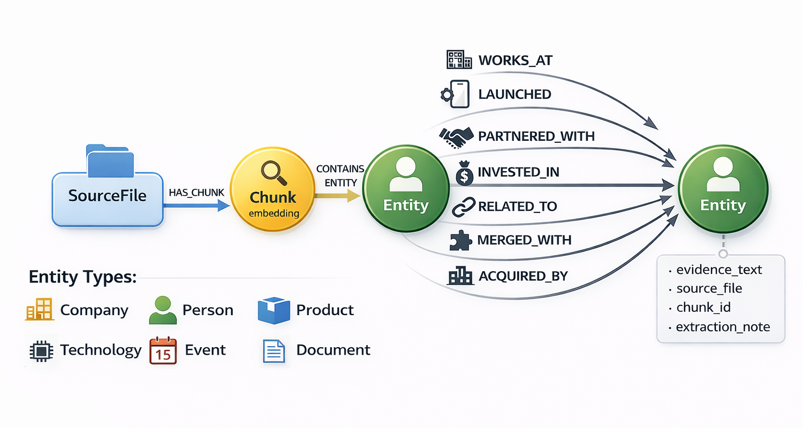

# GraphRAG Demo

한국 테크 기업 생태계 문서를 대상으로 **벡터 검색 + 그래프 탐색**을 결합한 GraphRAG 시스템입니다.

## 아키텍처

```
[인덱싱]
txt 파일 → 문단 청킹 → KURE-v1 임베딩 → Neo4j Chunk 노드 저장
                     → Claude Haiku 4.5 엔티티/관계 추출 → Neo4j 그래프 저장

[쿼리]
질문 → KURE-v1 임베딩 → 벡터 검색 (Chunk)
                      → 엔티티 확장 (Chunk → Entity)
                      → 그래프 탐색 (Entity → 관계 → Entity, 최대 2홉)
                      → Claude Sonnet 4.6 답변 생성
```

### 그래프 스키마



```
(:SourceFile)-[:HAS_CHUNK]->(:Chunk {embedding})
(:Chunk)-[:CONTAINS_ENTITY]->(:Entity)
(:Entity)-[:WORKS_AT | LAUNCHED | PARTNERED_WITH | INVESTED_IN | RELATED_TO | MERGED_WITH | ACQUIRED_BY {
    evidence_text, source_file, chunk_id, extraction_note
}]->(:Entity)
```

---

## 기술 스택

- **Graph DB / Vector DB**: Neo4j (그래프 + 벡터 인덱스 통합)
- **Embedding 모델**: nlpai-lab/KURE-v1 (한국어 특화, 1024차원)
- **LLM**: Claude API (claude-haiku-4-5-20251001 추출 / claude-sonnet-4-6 답변)
- **Web UI**: Streamlit
- **그래프 시각화**: streamlit-agraph

## 요구사항

- Python 3.10+
- Docker (Neo4j 실행용)
- Anthropic API 키

---

## 설치

### 1. 저장소 클론 및 의존성 설치

```bash
git clone <repo-url>
cd graphrag-test

# 가상환경 (권장)
python -m venv venv
venv\Scripts\activate      # Windows
# source venv/bin/activate # macOS/Linux

pip install -r requirements.txt
```

### 2. 환경변수 설정

```bash
cp .env.example .env
```

`.env` 파일을 열고 아래 값을 채웁니다:

```env
ANTHROPIC_API_KEY=sk-ant-...
NEO4J_URI=bolt://localhost:7687
NEO4J_USERNAME=neo4j
NEO4J_PASSWORD=your_password  # docker 실행할때 NEO4J_AUTH 부분에 적는 암호를 적으면 됩니다
```

### 3. Neo4j 실행 (Docker)

```bash
docker run \
  --name neo4j-graphrag \
  -p 7474:7474 -p 7687:7687 \
  -e NEO4J_AUTH=neo4j/your_password \
  -d \
  neo4j:latest
```

> Neo4j Browser: http://localhost:7474

---

## 실행

### 인덱싱 (최초 1회)

`data/` 폴더의 txt 파일을 읽어 Neo4j에 그래프를 구축합니다.

```bash
python main.py index
```

기존 데이터를 삭제하고 재인덱싱하려면:

```bash
python main.py index --reset
```

> 처음 실행 시 KURE-v1 모델 다운로드(약 1GB)가 자동으로 진행됩니다.

### 웹 UI 실행

```bash
# 가상환경 사용 시
streamlit run app.py

# 가상환경 없이 시스템 Python 사용 시
python -m streamlit run app.py
```

브라우저에서 http://localhost:8501 접속

### CLI 실행

```bash
# 단일 질의
python main.py query "SK텔레콤이 투자한 AI 기업은?"

# 대화형 모드
python main.py
```

---

## 예제 질문 및 그래프 탐색 결과

> SK텔레콤이 자체 출시한 AI 서비스와 투자한 글로벌 AI 기업을 모두 찾고,
> 해당 투자 기업이 또 어떤 거대 클라우드 기업들과 파트너십을 맺고 있는지 연결해서 설명해 줘

벡터 검색으로 관련 청크를 찾은 뒤, 그래프를 최대 2홉 탐색하면 아래와 같은 관계망이 구성됩니다.

```
SK텔레콤
  ├─[LAUNCHED]────→ 에이닷(A.)
  ├─[LAUNCHED]────→ AI 금융 비서 서비스 (에이닷 기반)
  ├─[자회사]──────→ SK브로드밴드 → B tv AI 기능
  └─[INVESTED_IN]─→ 앤트로픽 (1억 달러, 2023)
                        ├─[LAUNCHED]────────────────→ 클로드(Claude)
                        ├─[INVESTED_IN/PARTNERED_WITH]→ 아마존/AWS (최대 40억 달러)
                        │                                  └─ Amazon Bedrock으로 클로드 제공
                        └─[INVESTED_IN/PARTNERED_WITH]→ 구글
                                                           └─ 구글 클라우드로 클로드 제공
```

1홉(SK텔레콤 직접 관계)에서 자체 AI 서비스와 투자처를 찾고,
2홉(앤트로픽의 관계)에서 글로벌 클라우드 파트너십까지 자동으로 연결됩니다.

---

## 샘플 데이터

`data/` 폴더에 한국 테크 기업 생태계 관련 txt 파일 10개가 포함되어 있습니다.

| 파일 | 내용 |
|------|------|
| kakao_overview.txt | 카카오 기업 개요 및 자회사 |
| naver_overview.txt | 네이버 서비스 및 AI 전략 |
| samsung_ai.txt | 삼성전자 AI 전략 |
| sk_telecom_ai.txt | SK텔레콤 AI 전략 및 투자 |
| krafton_overview.txt | 크래프톤 게임 및 AI |
| hyundai_mobility.txt | 현대자동차 모빌리티 전략 |
| coupang_ecommerce.txt | 쿠팡 이커머스 전략 |
| lg_ai_research.txt | LG AI 연구원 |
| anthropic_korea.txt | 앤트로픽 한국 시장 |
| kiosk_fintech.txt | 한국 핀테크 생태계 |
| dunamu_overview.txt | 두나무 기업 개요 및 네이버파이낸셜 합병 |

자체 문서를 추가하려면 `data/` 폴더에 txt 파일을 넣고 `python main.py index --reset`을 실행하세요.

---

## 웹 UI 기능

- **스트리밍 답변**: Claude Sonnet 4.6이 실시간으로 답변을 생성
- **출처 표시**: 답변에 사용된 청크를 `[출처N]` 형식으로 인용, 클릭하면 원문 확인
- **관계 타입 버튼**: 답변에 사용된 관계를 버튼으로 표시, 클릭하면 사이드바 그래프에서 강조
- **관계 그래프**: 사이드바에서 엔티티/관계를 인터랙티브 그래프로 시각화
- **샘플 데이터**: 사이드바에서 원본 txt 파일 내용 확인 가능

---

## 프로젝트 구조

```
graphrag-test/
├── main.py              # CLI 진입점
├── app.py               # Streamlit 웹 UI
├── requirements.txt
├── .env.example
├── data/                # 샘플 txt 문서
└── src/
    ├── config.py        # 환경변수, 온톨로지 상수
    ├── chunker.py       # 문단 기준 청킹
    ├── extractor.py     # Claude Haiku 4.5 엔티티/관계 추출
    ├── embedder.py      # KURE-v1 임베딩 (1024차원)
    ├── graph.py         # Neo4j 스키마/저장/검색
    ├── indexer.py       # 인덱싱 파이프라인
    └── query.py         # 쿼리 파이프라인
```

---

## 주요 설정 (`src/config.py`)

| 항목 | 기본값 | 설명 |
|------|--------|------|
| `EXTRACTION_MODEL` | claude-haiku-4-5-20251001 | 엔티티/관계 추출 모델 |
| `QUERY_MODEL` | claude-sonnet-4-6 | 답변 생성 모델 |
| `EMBEDDING_MODEL` | nlpai-lab/KURE-v1 | 한국어 임베딩 모델 |
| `EMBEDDING_DIM` | 1024 | 임베딩 차원 수 |
| `MAX_CHUNK_CHARS` | 500 | 청크 최대 길이 |
